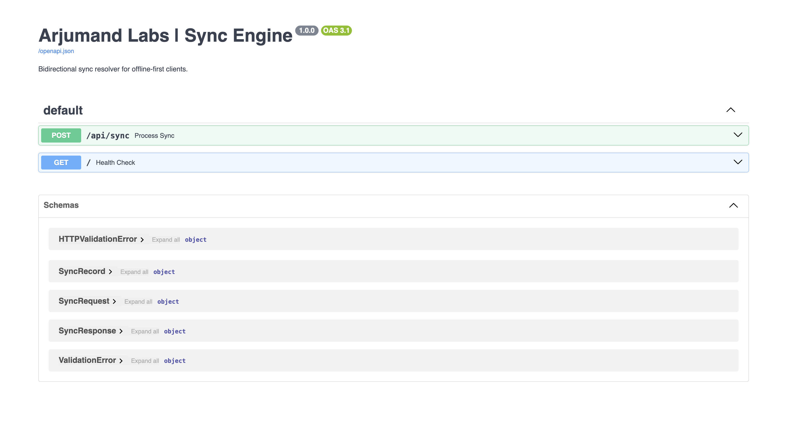

# ⚡ Offline-First Sync Engine (SQLite ↔ PostgreSQL)

A lightweight, production-ready bidirectional synchronization engine engineered for cross-platform desktop and mobile applications. It seamlessly resolves conflicts and synchronizes data between a local SQLite database and a remote PostgreSQL server.

**Engineered by [Arjumand Labs](https://github.com/FakhareArjumand)**


---

## 🏗️ The Problem
Enterprise applications require instantaneous local read/writes (SQLite) to survive network drops. However, keeping the local database in sync with a central cloud database (PostgreSQL) across multiple offline clients usually results in race conditions, data loss, and messy merge conflicts.

## 🚀 The Architecture
This engine solves offline synchronization using a **Timestamp-Based Conflict Resolution** model paired with an **Action Queue**.

1. **Local Mutations:** All client writes go to the local SQLite database instantly.
2. **The Queue:** Mutations are appended to a local sync queue with a UTC `updated_at` timestamp.
3. **Background Sync:** When the network restores, the Dart client pushes the queue to the Python/FastAPI backend.
4. **Conflict Resolution:** The Python server compares the client's `updated_at` with the server's database `updated_at`. The latest timestamp wins. Server state is pushed back to update the local SQLite client.

---

## 📸 API Documentation
The engine includes a fully typed FastAPI Swagger UI for testing sync payloads and conflict resolution.



---

## 📂 Repository Structure

*   `/client_dart`: A pure Dart implementation for managing the local SQLite database, tracking mutations, and pushing payload queues.
*   `/server_python`: A FastAPI PostgreSQL backend (via SQLAlchemy) that receives sync payloads, resolves conflicts, and returns server-side mutations.

---

## ⚡ Quick Start

### 1. Python Server (PostgreSQL / FastAPI)
```bash
cd server_python
python -m venv venv
source venv/bin/activate
pip install -r requirements.txt
python -m uvicorn main:app --reload
